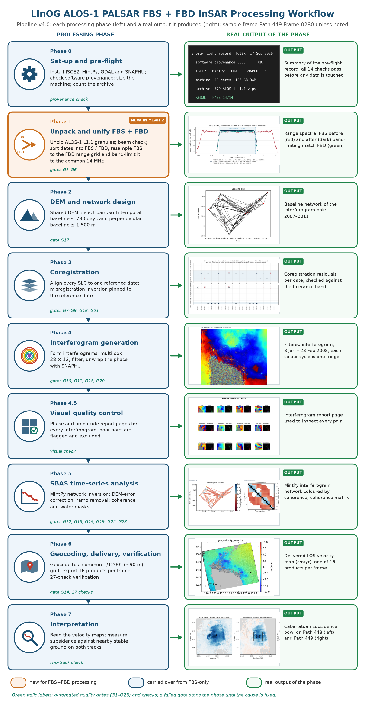
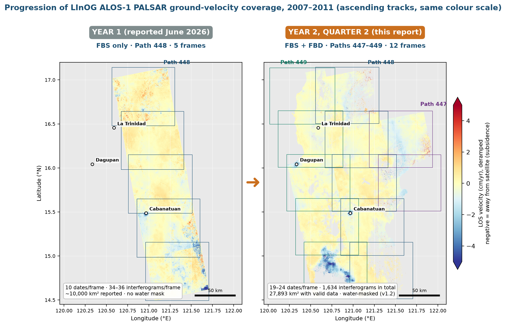
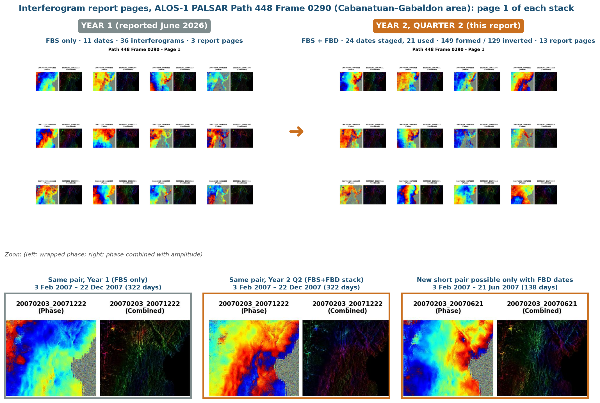
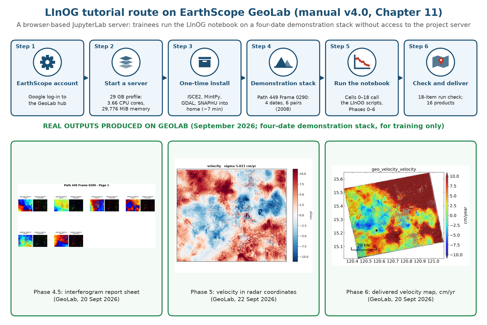

# Year 2, Quarter 2 (2026) — report figures

Figures prepared for the DOST/PCIEERD Year 2, Quarter 2 narrative progress report of the LInOG Project. The scripts that generate them are in [`scripts/figures/`](../../scripts/figures/). The report itself is not versioned here because it contains participant names and project-drive data.

| Report figure | File | Script |
|---|---|---|
| Figure 7: FBS+FBD processing workflow (pipeline v4.0) | `LInOG_FBSFBD_workflow_v4.0.png` | `make_workflow_figure.py`, `make_workflow_icons.py` |
| Figure 10: Year 1 vs Year 2 Q2 LOS velocity mosaic | `LInOG_mosaic_Y1_vs_Y2Q2.png` | `make_mosaic_compare.py` |
| Figure 13: P448 F0290 interferograms, before and after FBS+FBD | `LInOG_igrams_P448F0290_Y1_vs_Y2Q2.png` | `make_igram_compare.py` |
| Figure 15: GeoLab tutorial route (manual v4.0, Ch. 11) | `LInOG_GeoLab_tutorial_route_v4.0.png` | `make_geolab_figure.py` |
| Twelve-frame mosaic (v1.2, water-masked) | `LInOG_mosaic_12frames_v1.2.png` | `make_mosaic_compare.py` |
| Editable slides of all diagrams | `LInOG_Y2Q2_workflow_slides_editable.pptx` | `build_workflow_slides.py` |

## FBS+FBD processing workflow (v4.0)

## Progression of the velocity mosaic

## Interferograms before and after FBS+FBD (Path 448 Frame 0290)

## GeoLab tutorial route
The outputs in the lower row came from a four-date demonstration stack and are for training only; four dates are too few for a reliable deformation rate.

